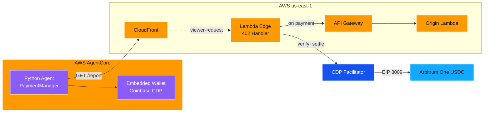
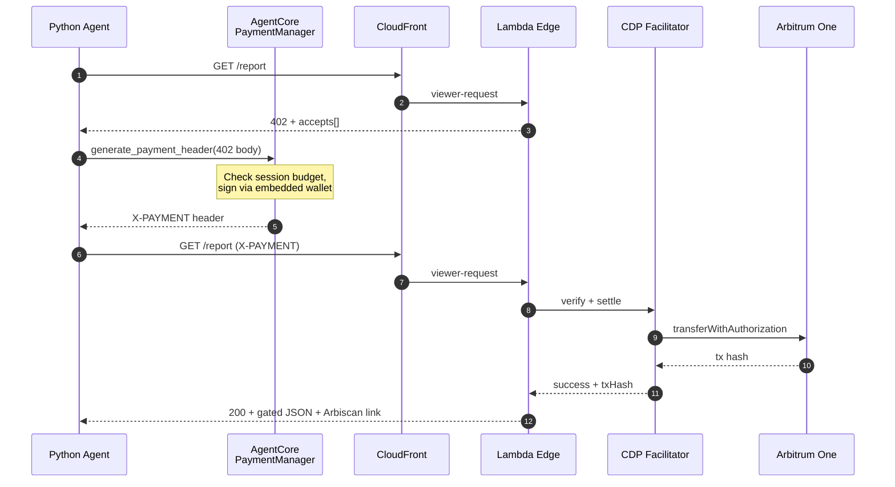
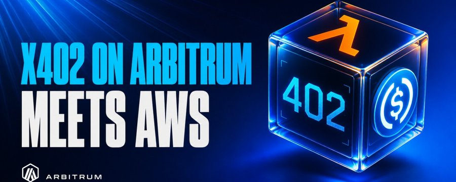

<!-- Banner -->
<p align="center">
  
</p>

<!-- Badges -->
<p align="center">
  <a href="LICENSE"></a>
  <a href="https://nodejs.org/"></a>
  <a href="https://pnpm.io/"></a>
  <a href="https://www.python.org/"></a>
  <a href="https://docs.astral.sh/uv/"></a>
  <a href="https://www.typescriptlang.org/"></a>
  <a href="https://aws.amazon.com/cdk/"></a>
  <a href="https://aws.amazon.com/bedrock/agentcore/"></a>
  <a href="https://arbitrum.io/"></a>
  <a href="https://www.x402.org/"></a>
</p>

<p align="center">
  <strong>End-to-end x402 payments on Arbitrum One. AWS CloudFront + Lambda@Edge merchant, paid by an AWS Bedrock AgentCore Python agent. USDC settles on Arbitrum One via Coinbase CDP.</strong>
</p>

<p align="center">
  <strong>New to CDP or AWS AgentCore?</strong> The <a href="docs/getting-started/README.md">zero-knowledge Getting Started guide</a> walks you from no accounts to a paid request, click by click.
</p>

## What's in this repo

| App | Path | Language | Role |
|:----|:-----|:---------|:-----|
| Merchant | [`apps/merchant`](apps/merchant/README.md) | TypeScript (pnpm) | Returns HTTP 402, verifies + settles via CDP facilitator, serves gated JSON |
| Agent | [`apps/agent`](apps/agent/README.md) | Python (uv) | Holds embedded wallet via AgentCore, pays on 402, retries with proof |
| `@x402-aws/shared` | [`packages/shared`](packages/shared) | TypeScript (pnpm) | x402 v2 protocol types + Arbitrum constants |

## Architecture



## End-to-end flow



<!-- Featured -->
<p align="center">
  <a href="https://x.com/hummusonrails/status/2049363842283544939">
    
  </a>
</p>
<p align="center">
  <sub><strong>Featured on X</strong> &middot; <a href="https://x.com/hummusonrails/status/2049363842283544939">The narrative behind this synthesis of x402, Arbitrum, and AWS &rarr;</a></sub>
</p>

## Quick Start

> This Quick Start assumes you already have CDP and AWS accounts, credentials, and tooling set up. If you don't, follow the [**Getting Started guide**](docs/getting-started/README.md) instead, it covers account creation, credentials, IAM, and every `.env` value with screenshots.

```bash
# 1. Install both stacks
make install

# 2. Configure
cp .env.example .env
$EDITOR .env   # set RECIPIENT_ADDRESS, AGENTCORE_*, etc.

# 3. Print CDP env for the merchant
pnpm --filter @x402-aws/merchant print-cdp-env /path/to/cdp_api_key.json
# Paste the printed lines into .env

# 4. Bootstrap CDK
pnpm --filter @x402-aws/merchant exec cdk bootstrap aws://$ACCOUNT_ID/us-east-1

# 5. Deploy the merchant
make deploy-merchant

# 6. Set RESOURCE_URL in .env from the merchant's DistributionDomainName output

# 7. Bootstrap the agent (creates AgentCore resources, prompts you to fund the wallet)
make setup-agent

# 8. Paste the printed PAYMENT_* IDs into .env

# 9. Run the agent
make run-agent
```

## Makefile

| Target | What it does |
|:-------|:-------------|
| `make install` | `pnpm install` + `uv sync` |
| `make test` | All tests across both stacks |
| `make synth` | CDK synth for the merchant |
| `make deploy-merchant` | CDK deploy |
| `make destroy-merchant` | CDK destroy |
| `make setup-agent` | Bootstrap AgentCore resources (one-time) |
| `make run-agent` | Run the agent against the merchant |
| `make teardown-agent` | Delete AgentCore resources |
| `make clean` | Remove all build artifacts and venvs |

## Tests

```bash
make test
```

26 tests: 17 in the merchant (vitest), 2 in `@x402-aws/shared` (vitest), 7 in the agent (pytest).

## Stack

| Layer | Tool |
|:------|:-----|
| Workspace | pnpm 9+ (apps/merchant, packages/*) + uv (apps/agent) + root Makefile |
| Merchant IaC | AWS CDK 2 (TypeScript) |
| CDN / edge | CloudFront + Lambda@Edge (Node 20, x86_64) |
| Origin | API Gateway HTTP API + Lambda (Node 20, ARM) |
| Settlement | CDP x402 facilitator |
| Agent runtime | Python 3.10+, `boto3`, `bedrock-agentcore[strands-agents]`, `httpx` |
| Wallet | AgentCore embedded wallet, Coinbase CDP |
| Chain | Arbitrum One (CAIP-2 `eip155:42161`) |
| Asset | Native USDC (`0xaf88d065e77c8cC2239327C5EDb3A432268e5831`) |

## Contributing

PRs welcome. Open an issue first for anything non-trivial.

## License

MIT. See [LICENSE](LICENSE).
