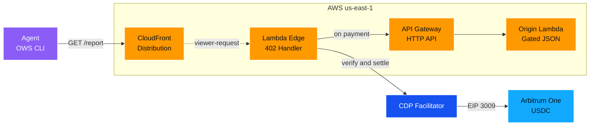
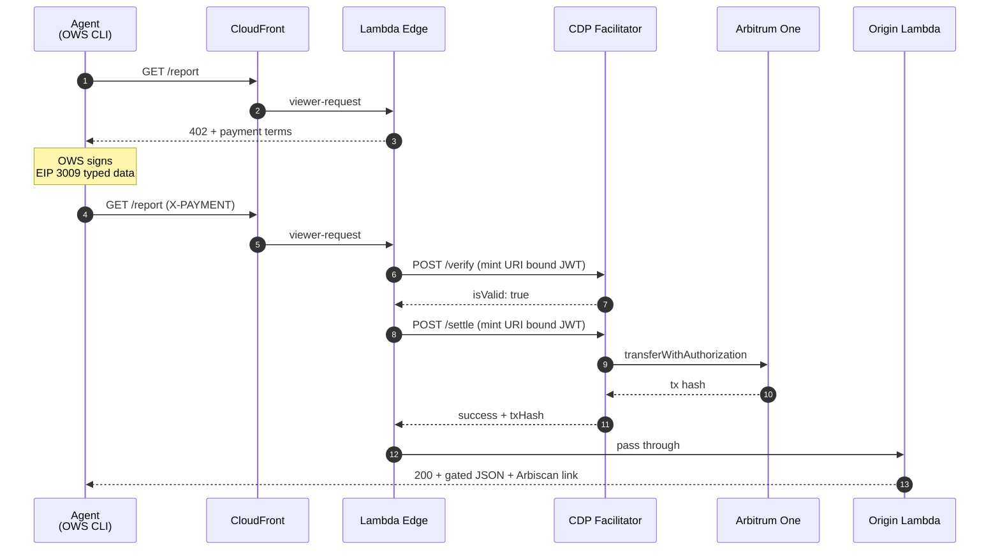

<!-- Banner -->
<p align="center">
  
</p>

<!-- Badges -->
<p align="center">
  <a href="LICENSE"></a>
  <a href="https://nodejs.org/"></a>
  <a href="https://www.typescriptlang.org/"></a>
  <a href="https://aws.amazon.com/cdk/"></a>
  <a href="https://arbitrum.io/"></a>
  <a href="https://www.x402.org/"></a>
  <a href="#contributing"></a>
</p>

<p align="center">
  <strong>End-to-end x402 payments on Arbitrum One, served behind AWS CloudFront and Lambda@Edge with the CDP facilitator.</strong>
  <br>
  <a href="https://aws.amazon.com/blogs/industries/x402-and-agentic-commerce-redefining-autonomous-payments-in-financial-services/">AWS Reference</a>
  ·
  <a href="#quick-start">Quick Start</a>
  ·
  <a href="provider/README.md">Provider Docs</a>
  ·
  <a href="agent/README.md">Agent Docs</a>
</p>

## What it does

- **Implements** the [AWS reference architecture](https://aws.amazon.com/blogs/industries/x402-and-agentic-commerce-redefining-autonomous-payments-in-financial-services/) for x402 agentic payments with Arbitrum One USDC as the settlement layer.
- **Returns** HTTP 402 with payment terms from a Lambda@Edge `viewer-request` function on every unpaid call to a gated CloudFront resource.
- **Mints** short-lived URI-bound CDP JWTs at the edge per `/verify` and `/settle` round trip, supporting both Ed25519 and ES256 keys.
- **Settles** USDC payments via EIP-3009 `transferWithAuthorization` on Arbitrum One through the CDP facilitator, no onchain logic on the provider side.
- **Pays** with a single OWS CLI command on the agent side, hot-key wallet stays encrypted at rest, signs without exposing the private key.

## Architecture



## Payment flow



## Quick Start

```bash
# 1. Configure environment
cp .env.example .env
$EDITOR .env   # set RECIPIENT_ADDRESS at minimum

# 2. Print CDP env vars from the JSON file you downloaded from CDP portal
cd provider && npx ts-node scripts/print-cdp-env.ts /path/to/cdp_api_key.json
# Paste the printed CDP_API_KEY_ID and CDP_PRIVATE_KEY lines into .env

# 3. Bootstrap CDK (one time per AWS account)
npx cdk bootstrap aws://$ACCOUNT_ID/us-east-1

# 4. Deploy the provider (10-20 min, mostly CloudFront propagation)
npx cdk deploy

# 5. Set RESOURCE_URL in .env from the DistributionDomainName output, then
cd ../agent
ows wallet create x402-demo
# Fund the wallet's EVM address with USDC on Arbitrum One
bash run.sh
```

Expected end state: `bash agent/run.sh` returns `{ "resource": "premium-market-data", ... }` plus an Arbiscan tx hash showing the onchain USDC settlement.

## Stack

| Layer | Tool | Notes |
|:------|:-----|:------|
| Provider IaC | AWS CDK 2 (TypeScript) | Single stack in `us-east-1`, bundles via esbuild |
| CDN | CloudFront | `CACHING_DISABLED`, all viewer headers forwarded |
| Edge logic | Lambda@Edge (Node 20, x86_64) | `viewer-request` trigger, returns 402 or proxies through |
| Origin | API Gateway HTTP API + Lambda (Node 20, ARM) | `GET /report` returns gated JSON |
| Settlement | CDP x402 facilitator | `https://api.cdp.coinbase.com/platform/v2/x402` |
| Auth to CDP | ES256 or EdDSA JWT | Per-request, URI-bound, 120s expiry, signed in `node:crypto` |
| Chain | Arbitrum One | CAIP-2 `eip155:42161` |
| Asset | Native USDC | `0xaf88d065e77c8cC2239327C5EDb3A432268e5831` |
| Agent | OWS CLI | `ows pay request <url> --wallet x402-demo` |
| Tests | vitest | 17 tests covering origin, edge, facilitator, JWT mint |


## Configuration

All deploy-time values live in `.env` at the repo root, loaded into the CDK app via dotenv at synth.

| Variable | Purpose |
|:---------|:--------|
| `CDP_API_KEY_ID` | The `id` (or `name`) field from your CDP API key JSON |
| `CDP_PRIVATE_KEY` | The `privateKey` PEM from the same JSON, with `\n` escapes |
| `RECIPIENT_ADDRESS` | Arbitrum One EVM address that receives USDC payments |
| `PRICE_USDC` | Price per request in 6-decimal base units (`10000` = $0.01) |
| `RESOURCE_URL` | The `DistributionDomainName` + `/report`, set after first deploy |
| `OWS_WALLET` | OWS wallet name used by the agent (default `x402-demo`) |

The CDP key material is inlined into the Lambda@Edge bundle at synth time. Lambda@Edge cannot read env vars at runtime, so this is the standard workaround. The bundle stays inside your AWS account but treat the deployment IAM scope as sensitive.

## Tests

```bash
cd provider
npm install
npm test
```

17 tests covering the origin handler, the edge function across all six branches (no header, valid payment, verify failure, settle failure, malformed header, facilitator network error), the per-request JWT minter for both Ed25519 and ES256 keys, and the facilitator client.

## Settlement timing trade-off

This implementation calls `/verify` then `/settle` in `viewer-request` before passing through to the origin. Production deployments should split this across `viewer-request` (verify) and `viewer-response` (settle) so settlement only happens after successful delivery. The relevant call site is the `verifyPayment` success branch in `provider/lib/edge-function/index.ts`. See [provider/README.md](provider/README.md) for the full discussion.

## Network

Arbitrum One mainnet only. Each request is approximately $0.01, so $1 of USDC covers a full build cycle. 

## Contributing

PRs welcome. Open an issue first for anything non-trivial.

## License

MIT. See [LICENSE](LICENSE).
