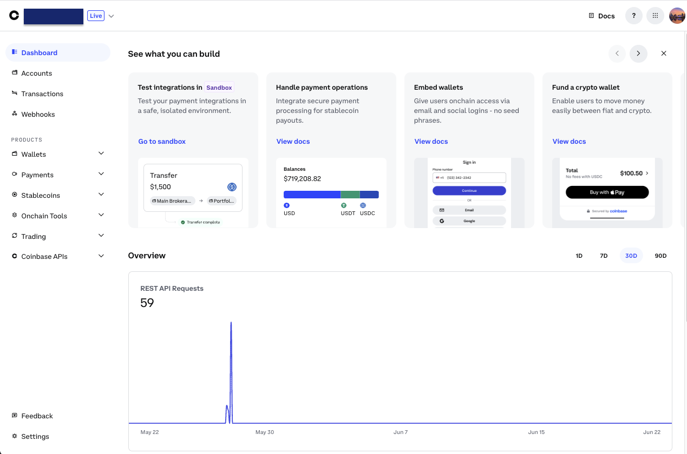
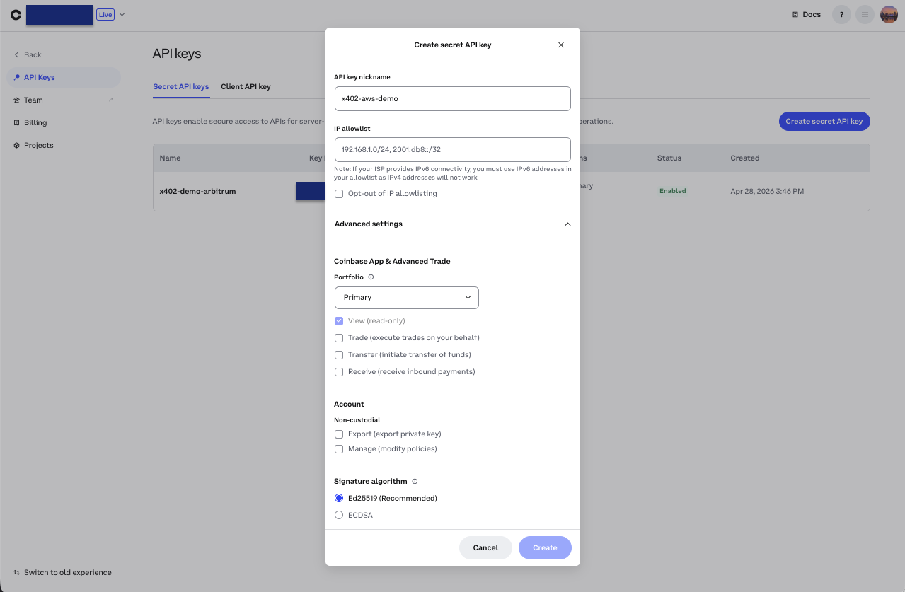
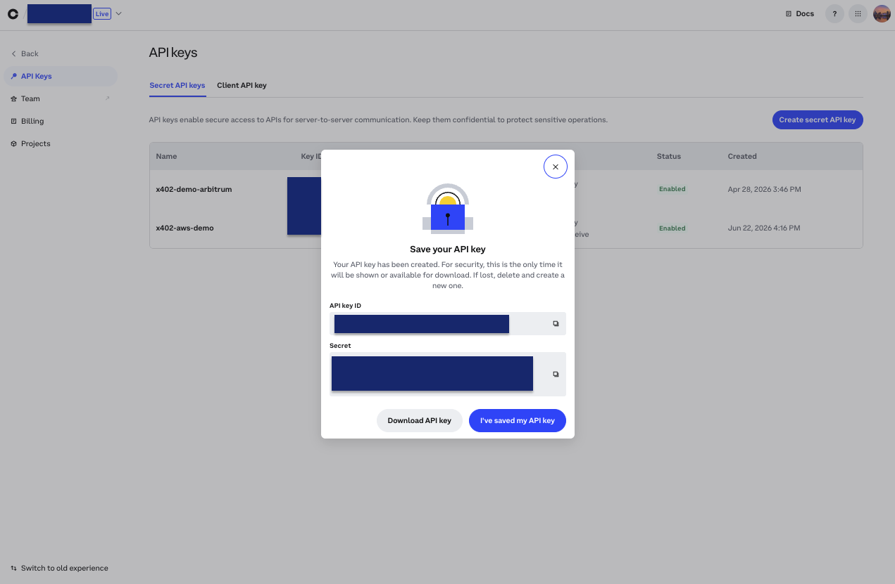
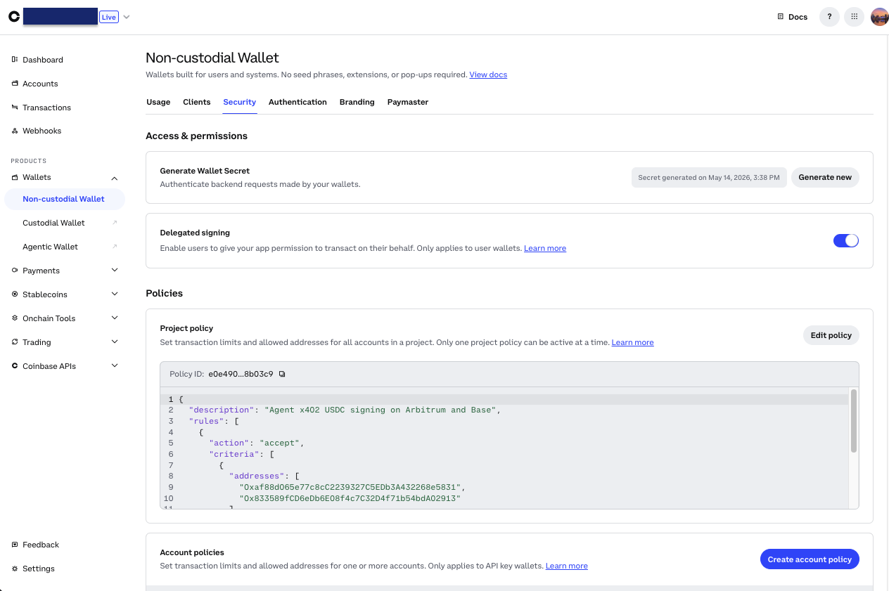
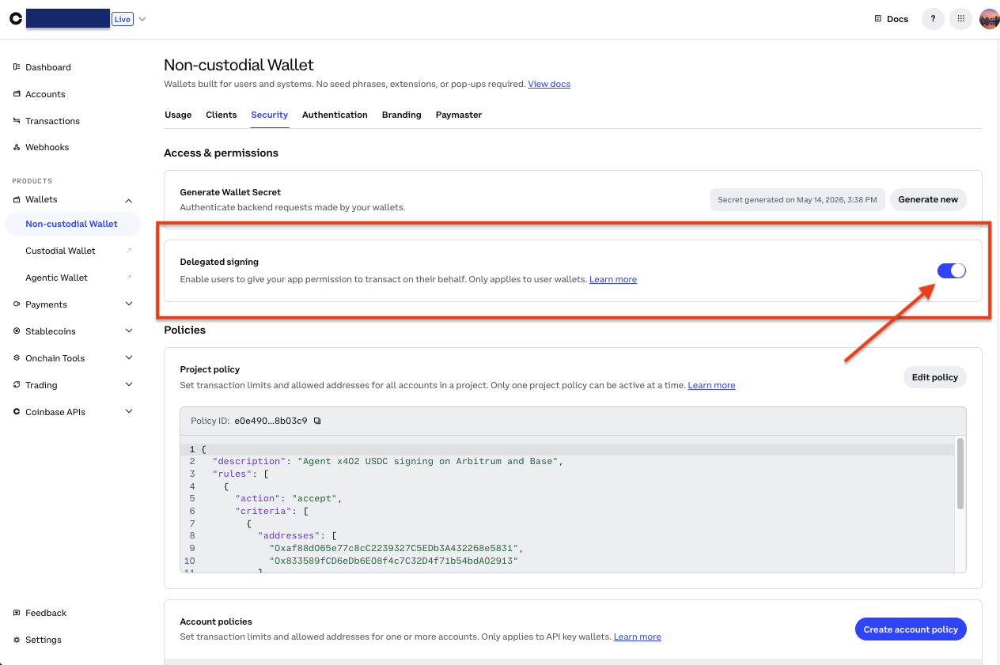

# Part 1: Set up Coinbase Developer Platform (CDP)

[Back to overview](README.md) · [Part 2: Set up AWS and the CLI →](02-aws-account-cli.md)

CDP gives you two things this demo needs:

- An **API key** the merchant uses to authenticate to the CDP facilitator (which
  verifies and settles payments on-chain).
- An **embedded wallet** the agent pays from, plus a **Wallet Secret** that lets
  AWS AgentCore sign transactions on the wallet's behalf.

By the end of this part you'll have three values for your `.env`:
`CDP_API_KEY_ID`, `CDP_PRIVATE_KEY`, and `CDP_WALLET_SECRET`.

> Everything here happens in the **CDP Portal** at
> [portal.cdp.coinbase.com](https://portal.cdp.coinbase.com).

## 1. Create an account and project

1. Go to **[portal.cdp.coinbase.com](https://portal.cdp.coinbase.com)** and sign
   up / sign in.
2. On first sign-in, CDP **automatically creates a project** for you. You can see
   and switch projects from the **dropdown at the top** of the portal, or at
   [portal.cdp.coinbase.com/projects/overview](https://portal.cdp.coinbase.com/projects/overview).

A project is just a container for your keys and wallets, the default one is
fine for this demo.

## 2. Create a Secret API key

1. Open the **API Keys** dashboard:
   [portal.cdp.coinbase.com/projects/api-keys](https://portal.cdp.coinbase.com/projects/api-keys).
2. Make sure the correct project is selected in the **top dropdown**.
3. Select the **Secret API Keys** tab.
4. Click **Create API key** and give it a name (e.g. `x402-aws-demo`).
5. Leave the defaults. Under **Advanced Settings** the **Signature algorithm**
   defaults to **Ed25519 (recommended)**, keep it. (ECDSA/ES256 is only for
   legacy Coinbase App SDKs; this demo uses the default.) You don't need to set
   any API restrictions or an IP allowlist for the demo.
6. Click **Create**.

### Save the key as a JSON file

After you click Create, CDP shows the **API Key ID** and **API Key Secret**.
**These are shown once: you cannot view the secret again.**

> [!IMPORTANT]
> CDP no longer auto-downloads a key file. Click the **Download API key** button
> in this modal to save the JSON file (e.g. `cdp_api_key.json`). The repo's
> helper script in [Part 5](05-configure-env.md) reads this file directly, so
> downloading it is the easiest path. If you only copy the two values, you can
> paste them manually instead, but downloading the file is simpler.

Save the file somewhere safe (you'll copy it to the repo root in Part 5). The
two values map to `.env` like this:

| In the CDP modal | In `.env` |
|:-----------------|:----------|
| API Key ID | `CDP_API_KEY_ID` |
| API Key Secret (the private key) | `CDP_PRIVATE_KEY` |

## 3. Generate a Wallet Secret

The Wallet Secret is separate from the API key. AgentCore uses it to perform
signing operations on the embedded wallet.

1. Open the wallet security page:
   [portal.cdp.coinbase.com/wallets/non-custodial/security](https://portal.cdp.coinbase.com/wallets/non-custodial/security).
2. Confirm the correct project is selected in the top dropdown.
3. In the **Security** section, click **Generate**.
4. **Copy the Wallet Secret immediately**, like the API key secret, it's shown
   once and can't be viewed again. This is your `CDP_WALLET_SECRET`.

## 4. Enable Delegated signing

AgentCore can only sign on the wallet's behalf if **Delegated signing** is
enabled. This is a hard prerequisite.

1. In the portal, go to **Wallet → Embedded Wallets → Policies**.
2. **Enable Delegated signing.**

Delegated signing is what lets the agent's backend (AgentCore) sign transactions
from the embedded wallet within the permissions the wallet owner grants.

## What you should have now

- [ ] A downloaded API key JSON file (→ `CDP_API_KEY_ID`, `CDP_PRIVATE_KEY`)
- [ ] A Wallet Secret saved somewhere safe (→ `CDP_WALLET_SECRET`)
- [ ] Delegated signing enabled on Embedded Wallets

---

**Next:** [Part 2 sets up your AWS account and the AWS CLI](02-aws-account-cli.md).
