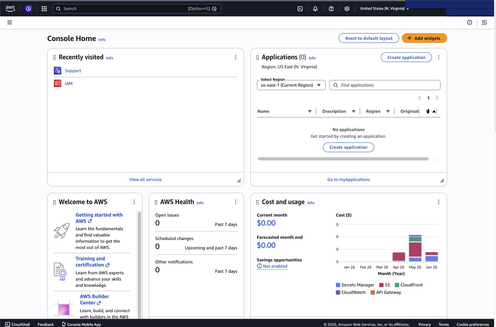
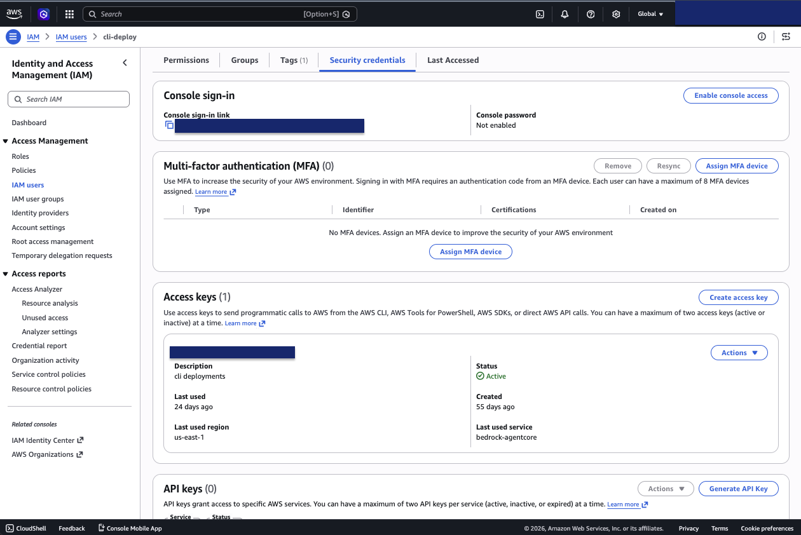
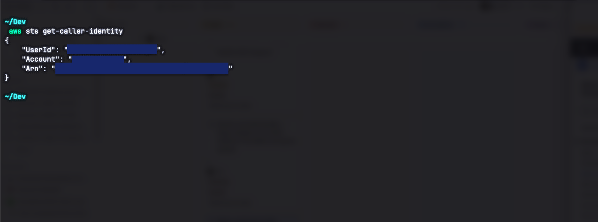

# Part 2: Set up AWS and the CLI

[← Part 1: Coinbase Developer Platform](01-coinbase-cdp.md) · [Back to overview](README.md) · [Part 3: AgentCore IAM role →](03-aws-agentcore-iam.md)

You'll host the merchant and run the agent's payment manager on AWS. This part
gets you an AWS account and a working `aws` CLI on your machine.

## 1. Create an AWS account

If you already have an AWS account, skip to step 2.

Go to **[aws.amazon.com](https://aws.amazon.com/)** and choose **Create an AWS
account** (or go directly to
[portal.aws.amazon.com/billing/signup](https://portal.aws.amazon.com/billing/signup)).
The sign-up is a 5-step wizard:

1. **Email + account name + password.** Enter your email and an account name,
   verify the emailed code, then set a strong **root user password**.
2. **Contact information.** Choose **Personal** or **Business** (no functional
   difference, it only affects billing details), fill in your details, and
   accept the AWS Customer Agreement.
3. **Payment method.** Enter a credit/debit card. A small temporary hold is
   placed to verify it. You can't proceed without one.
4. **Confirm your identity.** Verify by SMS or voice call and solve the CAPTCHA.
5. **Support plan.** Choose **Basic Support: free**. You can change this later.

Activation usually takes a few minutes (occasionally up to 24 hours). You'll get
an email when the account is ready.

> [!NOTE]
> Creating an account requires solving a CAPTCHA and entering payment details
> yourself in a browser.



## 2. Install the AWS CLI v2 (macOS)

AWS distributes an official macOS installer. (AWS does **not** officially
maintain a Homebrew formula, so use the official `.pkg` to be sure you get a
current, supported version.)

Command-line install (installs for all users; needs `sudo`):

```bash
curl "https://awscli.amazonaws.com/AWSCLIV2.pkg" -o "AWSCLIV2.pkg"
sudo installer -pkg ./AWSCLIV2.pkg -target /
```

Or download and run the GUI installer:
[awscli.amazonaws.com/AWSCLIV2.pkg](https://awscli.amazonaws.com/AWSCLIV2.pkg).

Verify:

```bash
which aws        # -> /usr/local/bin/aws
aws --version    # -> aws-cli/2.x.x Python/3.x Darwin/...
```

## 3. Configure credentials

You need to give the CLI credentials for your account.

> [!IMPORTANT]
> AWS's current best practice is **IAM Identity Center** (`aws configure sso`)
> rather than long-term IAM access keys, especially for anything production. For a
> personal getting-started run, IAM user access keys via `aws configure` are
> acceptable, and are exactly what the AgentCore Payments quick start itself
> uses. Pick whichever fits you.

**Option A: IAM Identity Center (recommended):**

```bash
aws configure sso
```

The wizard prompts for an SSO start URL, region, then lets you pick an account,
role, default region, and profile name.

**Option B: IAM user access keys (simplest for a quick test):**

1. In the AWS console, create an IAM user (or use an existing one) with
   permissions to deploy the demo (Administrator access is simplest for a
   personal account; scope it down for anything shared).
2. Create an **access key** for that user (IAM → Users → your user → Security
   credentials → Create access key → "Command Line Interface (CLI)").
3. Run:

```bash
aws configure
```

Enter the **Access Key ID**, **Secret Access Key**, default region
(**`us-east-1`** for this demo), and output format (`json`).



## 4. Verify it works

```bash
aws sts get-caller-identity
```

You should get back your `UserId`, a 12-digit `Account`, and the `Arn` of your
identity. **Note the `Account` number**, you'll need it in Part 3 and Part 6.



---

**Next:** [Part 3 creates the IAM role AgentCore needs](03-aws-agentcore-iam.md).
