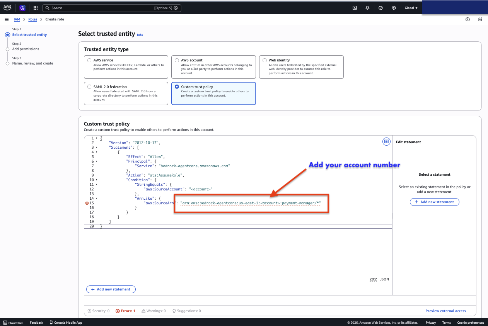
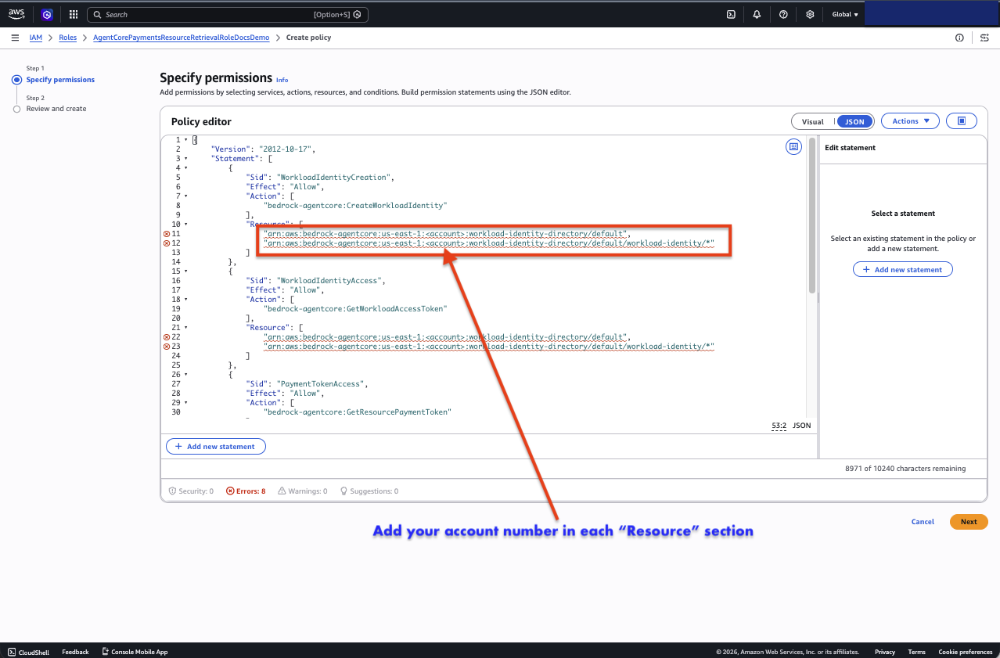
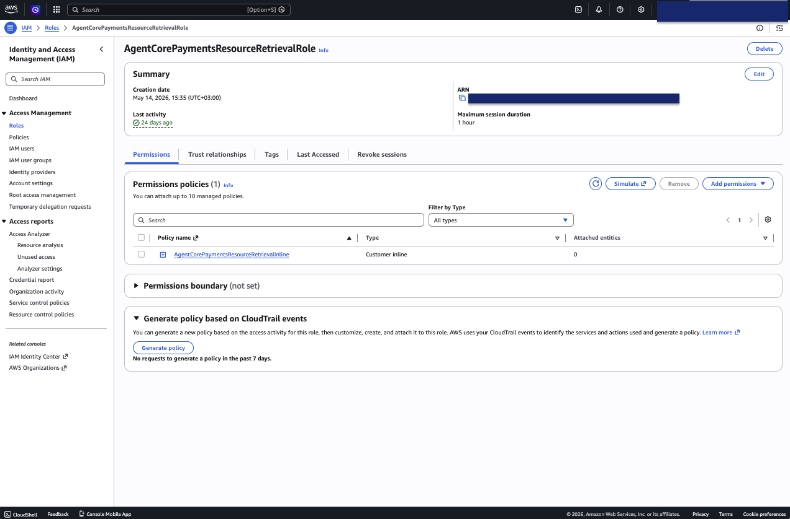

# Part 3: Create the AgentCore IAM role

[← Part 2: AWS and the CLI](02-aws-account-cli.md) · [Back to overview](README.md) · [Part 4: Local setup →](04-local-setup.md)

AWS Bedrock AgentCore Payments needs a **service role** it can assume at runtime
to retrieve your payment credentials and manage wallet identities. The agent's
`setup-agent` step references this role by name:

```
arn:aws:iam::<your-account>:role/AgentCorePaymentsResourceRetrievalRole
```

So you create a role with **exactly that name** (or set
`AGENTCORE_SERVICE_ROLE_ARN` in `.env` to a different ARN).

> [!NOTE]
> In AWS's docs this is the **ResourceRetrievalRole**, one of a four-role
> model. It's a *service* role assumed by `bedrock-agentcore.amazonaws.com`, not
> a role for humans. AWS attaches some permissions automatically when you create
> a Payment Manager, but because this repo references the role by name and
> creates the manager non-interactively, you'll create the role **with the trust
> policy and permissions below** so it works on the first run.

You'll do this in the **IAM console**. Have your 12-digit account ID handy (from
`aws sts get-caller-identity` in Part 2).

## 1. Start a new role with a custom trust policy

1. Open **IAM → Roles → Create role**.
2. For **Trusted entity type**, choose **Custom trust policy** (the principal is
   an AWS service with conditions, so the standard templates don't fit).
3. Paste this trust policy, replacing `<account>` with your account ID. The
   `payment-manager/*` wildcard covers the auto-generated manager names this demo
   creates:

```json
{
    "Version": "2012-10-17",
    "Statement": [
        {
            "Effect": "Allow",
            "Principal": {
                "Service": "bedrock-agentcore.amazonaws.com"
            },
            "Action": "sts:AssumeRole",
            "Condition": {
                "StringEquals": {
                    "aws:SourceAccount": "<account>"
                },
                "ArnLike": {
                    "aws:SourceArn": "arn:aws:bedrock-agentcore:us-east-1:<account>:payment-manager/*"
                }
            }
        }
    ]
}
```

> The AWS docs show a stricter `SourceArn` of
> `...:payment-manager/<payment-manager-name>-*`. Because this demo generates
> manager names dynamically, the `payment-manager/*` wildcard above is the
> reliable choice. Tighten it for production. If you run in a region other than
> `us-east-1`, change the region segment to match `AGENTCORE_REGION`.



## 2. Create the role (skip attaching policies for now)

After pasting the trust policy, click **Next**. The **Add permissions** step only
lets you attach *existing* managed policies, **there is no JSON editor here**.
Click **Next** again **without selecting anything**; you'll add the custom policy
as an inline policy once the role exists.

On **Name, review, and create**, set **Role name** to exactly
**`AgentCorePaymentsResourceRetrievalRole`**, confirm the trust policy is present,
and click **Create role**.

## 3. Add the permissions as an inline policy

Open the new role → **Permissions** tab → **Add permissions ▾** → **Create inline
policy** → **JSON** tab. Paste the following (replace `<account>`; uses
`us-east-1`, change if needed). This combines the base permissions and the
credential/secret access the connector needs, with demo-friendly wildcards:

```json
{
    "Version": "2012-10-17",
    "Statement": [
        {
            "Sid": "WorkloadIdentityCreation",
            "Effect": "Allow",
            "Action": [
                "bedrock-agentcore:CreateWorkloadIdentity"
            ],
            "Resource": [
                "arn:aws:bedrock-agentcore:us-east-1:<account>:workload-identity-directory/default",
                "arn:aws:bedrock-agentcore:us-east-1:<account>:workload-identity-directory/default/workload-identity/*"
            ]
        },
        {
            "Sid": "WorkloadIdentityAccess",
            "Effect": "Allow",
            "Action": [
                "bedrock-agentcore:GetWorkloadAccessToken"
            ],
            "Resource": [
                "arn:aws:bedrock-agentcore:us-east-1:<account>:workload-identity-directory/default",
                "arn:aws:bedrock-agentcore:us-east-1:<account>:workload-identity-directory/default/workload-identity/*"
            ]
        },
        {
            "Sid": "PaymentTokenAccess",
            "Effect": "Allow",
            "Action": [
                "bedrock-agentcore:GetResourcePaymentToken"
            ],
            "Resource": [
                "arn:aws:bedrock-agentcore:us-east-1:<account>:token-vault/default",
                "arn:aws:bedrock-agentcore:us-east-1:<account>:workload-identity-directory/default",
                "arn:aws:bedrock-agentcore:us-east-1:<account>:workload-identity-directory/default/workload-identity/*",
                "arn:aws:bedrock-agentcore:us-east-1:<account>:payment-credential-provider/*"
            ]
        },
        {
            "Sid": "SecretsManagerAccess",
            "Effect": "Allow",
            "Action": [
                "secretsmanager:GetSecretValue"
            ],
            "Resource": "*",
            "Condition": {
                "StringEquals": {
                    "aws:ResourceAccount": "<account>"
                }
            }
        }
    ]
}
```

Click **Next**, name it e.g. `AgentCorePaymentsResourceRetrievalPolicy`, and
**Create policy**. As an inline policy it's attached to the role automatically.

> The `secretsmanager:GetSecretValue` statement is scoped to your account via the
> `aws:ResourceAccount` condition. For production, scope `Resource` to the
> specific connector secret ARNs that AWS creates.



## 4. Confirm the role

Back on the role's summary page, confirm the name is exactly
**`AgentCorePaymentsResourceRetrievalRole`**, the inline policy is listed under
**Permissions**, and the **Trust relationships** tab shows the
`bedrock-agentcore.amazonaws.com` principal.



## 5. (Optional) Confirm from the CLI

```bash
aws iam get-role --role-name AgentCorePaymentsResourceRetrievalRole \
  --query 'Role.Arn' --output text
```

This prints the role ARN. As long as the role exists with that name, the agent's
`setup-agent` will find it automatically (it builds the ARN from your account
ID). If you used a different name, set `AGENTCORE_SERVICE_ROLE_ARN` to this ARN in
`.env`.

---

**Next:** the cloud accounts are ready. [Part 4 installs the local
toolchain](04-local-setup.md) and clones the repo.
