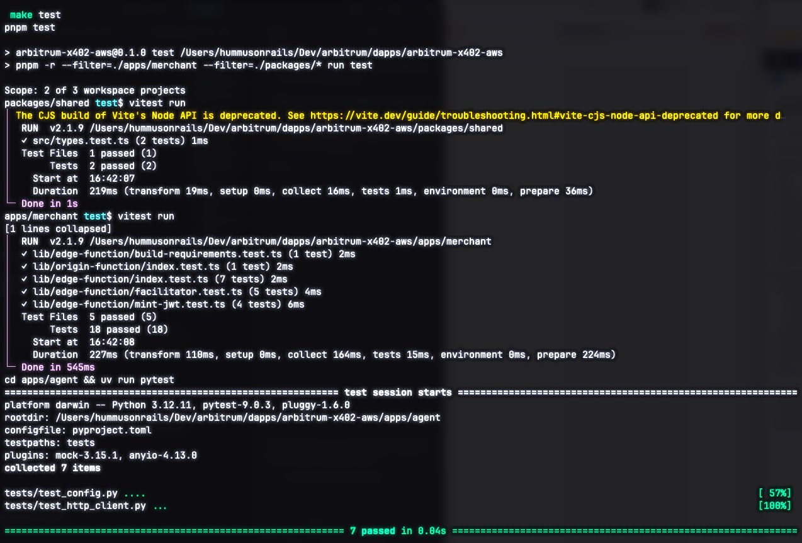

# Part 4: Install local tooling and clone the repo

[← Part 3: AgentCore IAM role](03-aws-agentcore-iam.md) · [Back to overview](README.md) · [Part 5: Configure your `.env` →](05-configure-env.md)

By the end of this part you'll have the repository cloned and all dependencies
installed, with `make install` completing cleanly.

> These instructions are written for **macOS**. On Linux the package names are
> the same; use your distro's package manager (or the official installers) in
> place of Homebrew.

## What you need

| Tool | Version | Why |
|:-----|:--------|:----|
| **Node.js** | 20.x or newer | Runs the merchant build, CDK, and the CDP env helper |
| **pnpm** | 10.13.x (pinned) | Workspace package manager for the TypeScript side |
| **Python** | 3.10 or newer | Runs the agent |
| **uv** | latest | Python dependency manager for the agent |
| **Git** | any recent | Cloning the repo |

## 1. Install Node.js 20+

The simplest route on macOS is [Homebrew](https://brew.sh/):

```bash
brew install node@20
```

Verify:

```bash
node --version   # should print v20.x.x or newer
```

> If you manage multiple Node versions, [`nvm`](https://github.com/nvm-sh/nvm)
> (`nvm install 20 && nvm use 20`) works just as well.

## 2. Enable pnpm via Corepack

This repo **pins** its pnpm version (`pnpm@10.13.1`) in `package.json`. The
cleanest way to get exactly that version is Corepack, which ships with Node:

```bash
corepack enable
```

Corepack reads the pinned version from `package.json` automatically the first
time you run `pnpm` inside the repo, so you don't install pnpm globally yourself.
Verify after cloning (next step):

```bash
pnpm --version   # should print 10.13.1 once you're inside the repo
```

## 3. Install Python 3.10+ and uv

```bash
brew install python@3.12        # any 3.10+ works
python3 --version               # confirm 3.10 or newer
```

Install [uv](https://docs.astral.sh/uv/) (the agent's dependency manager):

```bash
curl -LsSf https://astral.sh/uv/install.sh | sh
```

Restart your shell (or `source` your profile) and verify:

```bash
uv --version
```

## 4. Clone the repository

```bash
git clone https://github.com/hummusonrails/arbitrum-x402-aws.git
cd arbitrum-x402-aws
```

> If you're reading this guide from inside an existing checkout, you can skip
> the clone and just `cd` into the repo root.

## 5. Install all dependencies

From the **repo root**, the Makefile installs both stacks (pnpm for the
merchant, uv for the agent) in one command:

```bash
make install
```

This runs `pnpm install` and then `cd apps/agent && uv sync`. It can take a
couple of minutes the first time.

## 6. Confirm everything builds

Run the full test suite to confirm the toolchain is healthy:

```bash
make test
```

You should see the TypeScript (vitest) and Python (pytest) suites pass. This
proves Node, pnpm, Python, and uv are all wired up correctly **before** you
touch any cloud resources.



---

**Next:** with the toolchain in place, [Part 5 walks through every `.env`
variable](05-configure-env.md) and exactly where each value comes from.
