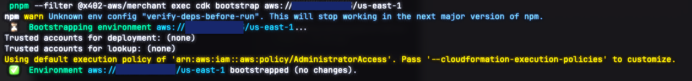
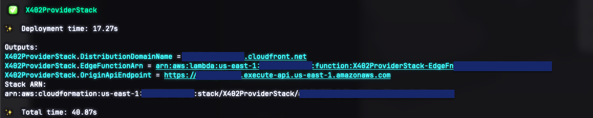
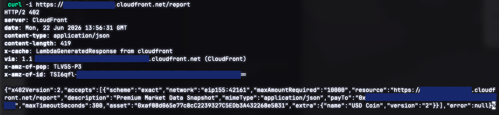

# Part 6: Deploy the merchant

[← Part 5: Configure your `.env`](05-configure-env.md) · [Back to overview](README.md) · [Part 7: Fund the wallet and run the agent →](07-run-the-agent.md)

The merchant is the seller, a CloudFront distribution with a Lambda@Edge
function that speaks x402, backed by an API Gateway + Lambda origin. You deploy
it with AWS CDK. By the end you'll have a live HTTPS URL and `RESOURCE_URL` set
in `.env`.

> The merchant always deploys to **`us-east-1`** (required for Lambda@Edge). Make
> sure your AWS CLI from [Part 2](02-aws-account-cli.md) is configured for that
> account.

## 1. Confirm your AWS identity and account ID

```bash
aws sts get-caller-identity
```

Note the `Account` value (a 12-digit number), you'll need it for the bootstrap
command.

## 2. Bootstrap CDK (one time per account/region)

CDK needs a one-time "bootstrap" stack in each account/region before its first
deploy. Replace `<ACCOUNT_ID>` with the number from the previous step:

```bash
pnpm --filter @x402-aws/merchant exec cdk bootstrap aws://<ACCOUNT_ID>/us-east-1
```

This creates a small CloudFormation stack (`CDKToolkit`) that holds deploy
assets. You only do this once per account/region, skip it on future deploys.



## 3. Deploy the merchant

From the repo root:

```bash
make deploy-merchant
```

This runs `cdk deploy --require-approval never` for the `X402ProviderStack`. CDK
synthesizes the stack, uploads the Lambda bundles, and creates the CloudFront
distribution. **CloudFront takes several minutes** to finish provisioning, this
is normal.

When it completes, CDK prints the stack outputs, including:

```
X402ProviderStack.DistributionDomainName = dxxxxxxxxxxxxx.cloudfront.net
```



## 4. Set `RESOURCE_URL` in `.env`

Take the `DistributionDomainName` and write it into `.env` with the `/report`
path and `https://` prefix:

```
RESOURCE_URL=https://dxxxxxxxxxxxxx.cloudfront.net/report
```

## 5. Smoke-test the 402

Before paying anything, confirm the endpoint correctly asks for payment. An
unpaid request should return **HTTP 402** with payment terms in the body:

```bash
curl -i https://dxxxxxxxxxxxxx.cloudfront.net/report
```

You should see `HTTP/2 402` and a JSON body describing the price and the
Arbitrum One network it accepts.

> If you instead get a 403 or the request hangs, CloudFront may still be
> propagating. Lambda@Edge changes can take **5–15 minutes** to reach all edge
> locations after a deploy. Wait and retry before debugging.



---

**Next:** the merchant is live and asking for payment. [Part 7 provisions the
agent's wallet, funds it, and makes the paid call](07-run-the-agent.md).
