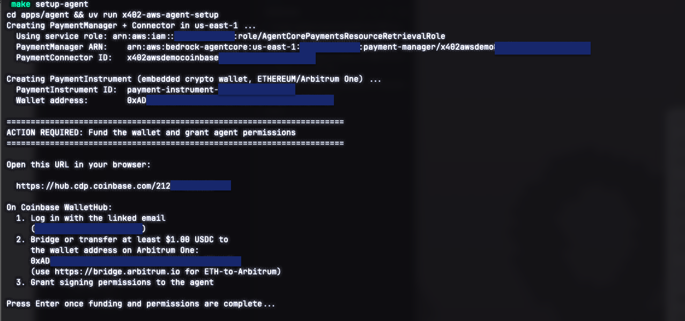
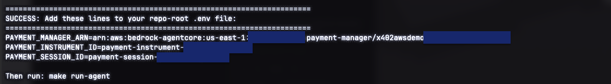
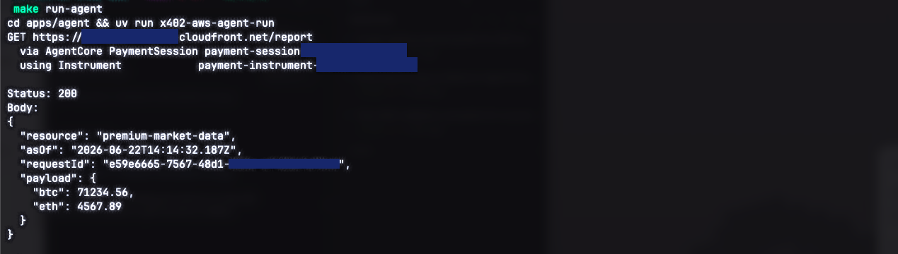

# Part 7: Fund the wallet and run the agent

[← Part 6: Deploy the merchant](06-deploy-merchant.md) · [Back to overview](README.md) · [Troubleshooting & teardown →](08-troubleshooting.md)

This is the payoff. You'll provision the agent's embedded wallet, fund it with a
little USDC on Arbitrum One, and then watch the agent pay the merchant and
receive the gated report.

There are three commands, with a manual funding step in the middle:

1. `make setup-agent`, creates the wallet and prints a funding URL, then waits.
2. **You fund the wallet** with USDC on Arbitrum One.
3. `make run-agent`, makes the paid request and prints the report.

## 1. Bootstrap the AgentCore resources

From the repo root:

```bash
make setup-agent
```

This one-time bootstrap (driven by `apps/agent/src/x402_aws_agent/setup.py`):

- Creates a **PaymentManager** + **PaymentConnector** from your CDP credentials,
  using the IAM role from [Part 3](03-aws-agentcore-iam.md).
- Creates a **PaymentInstrument**, the embedded crypto wallet on Ethereum /
  Arbitrum One, linked to your `AGENTCORE_LINKED_EMAIL`.
- Prints the **wallet address** and a **Coinbase WalletHub URL**, then pauses
  with `Press Enter once funding and permissions are complete...`.

**Do not press Enter yet.** Copy the wallet address and the URL it prints.

> [!IMPORTANT]
> **`make setup-agent` reuses the wallet already in your `.env`.** By default, if
> `PAYMENT_MANAGER_ARN` and `PAYMENT_INSTRUMENT_ID` are already set, re-running it
> keeps the **same** wallet (re-printing its address + grant URL) and only mints a
> fresh session, so you won't accidentally orphan a funded, granted wallet.
>
> - **First run** (empty `.env`): a new wallet is created. Fund and grant **the
>   exact address it prints**.
> - To deliberately create a **brand-new** wallet, run
>   `cd apps/agent && uv run x402-aws-agent-setup --force-new` (the old wallet and
>   its funds are left untouched; the new one must be funded + granted again).
> - If a run fails with *"Delegated signing grant is not active"*, re-fetch the
>   current wallet's address + grant URL and complete the grant on **that** wallet:
>   ```bash
>   cd apps/agent && uv run python ../../scripts/inspect_instrument.py
>   ```
> - If only the **session** expired, mint a fresh one without a new wallet:
>   ```bash
>   cd apps/agent && uv run python ../../scripts/new_session.py
>   ```
>   and paste the printed id into `PAYMENT_SESSION_ID`.



## 2. Fund the wallet with USDC on Arbitrum One

The agent needs **USDC on Arbitrum One** at the printed wallet address, plus a
tiny amount of ETH on Arbitrum One for gas. `$1–$2` of USDC is plenty (each
request costs `$0.01`).

You have two practical options:

- **Send directly:** from an exchange or another wallet, send USDC **on the
  Arbitrum One network** to the printed wallet address. Make sure you select
  Arbitrum One as the network, not Ethereum mainnet or Base.
- **Bridge:** move ETH/USDC to Arbitrum One via
  [bridge.arbitrum.io](https://bridge.arbitrum.io), then send to the address.

> [!IMPORTANT]
> **Coinbase WalletHub's balance view focuses on Base.** When you open the
> WalletHub URL, it may show a Base balance and may not surface a "Send" control
> or display funds you hold on Arbitrum One. That's a display limitation, the
> embedded wallet address is the same across EVM chains, and your USDC **is**
> there on Arbitrum One even if WalletHub doesn't show it. Verify the balance on
> [Arbiscan](https://arbiscan.io) by pasting the wallet address instead of
> relying on WalletHub's display.

Use the WalletHub URL primarily to **log in (with `AGENTCORE_LINKED_EMAIL`) and
grant the agent signing permissions** if prompted.

## 3. Finish setup

Back in the terminal where `make setup-agent` is waiting, press **Enter**. It
creates a **PaymentSession** (with your `AGENTCORE_MAX_SPEND_USD` budget) and
prints three IDs:

```
PAYMENT_MANAGER_ARN=arn:aws:bedrock-agentcore:us-east-1:...:payment-manager/...
PAYMENT_INSTRUMENT_ID=...
PAYMENT_SESSION_ID=...
```

Copy all three lines into your repo-root `.env`, replacing the blank
placeholders from [Part 5](05-configure-env.md).



## 4. Run the agent

With all `PAYMENT_*` values and `RESOURCE_URL` set:

```bash
make run-agent
```

The agent:

1. `GET`s `RESOURCE_URL` and receives `402` with the payment terms.
2. Calls `PaymentManager.generate_payment_header()` to sign a payment from the
   embedded wallet (within the session budget).
3. Retries the request with the `X-PAYMENT` header.
4. The merchant verifies and settles via the CDP facilitator, USDC moves on
   Arbitrum One, and the merchant returns `200` with the gated JSON.

You'll see the gated report printed, along with an Arbiscan link to the on-chain
USDC transfer.



## 5. Confirm on-chain

Open the printed Arbiscan link. You should see a `transferWithAuthorization`
USDC transfer from the agent's wallet to your `RECIPIENT_ADDRESS`, for the
configured price. That's the whole loop working end to end.

---

🎉 **You did it.** An AI agent autonomously paid for and retrieved gated data,
with settlement on Arbitrum One.

If anything went wrong, see [Troubleshooting & teardown](08-troubleshooting.md),
which also covers how to **delete the AgentCore resources so you stop being
billed** for them.
