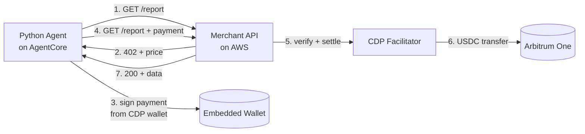

# Getting Started: from zero to a paid API call

This guide takes you from **nothing installed and no accounts** to a working
end-to-end demo where an AI agent pays a merchant API in real USDC on Arbitrum
One and receives gated data back.

It assumes you are a competent developer who is comfortable in a terminal, but
assumes **no prior experience** with any of the services involved, Coinbase
Developer Platform (CDP), AWS Bedrock AgentCore, AWS CDK, or x402. Every account
sign-up, console click, and credential is spelled out, with screenshots.

If you already use these services and just want the commands, the terse
[Quick Start in the root README](../../README.md#quick-start) is faster.

## What you are going to build

There are two halves to this demo:

1. **A merchant API** (the seller). It is a small HTTP service deployed to AWS.
   When you request its `/report` endpoint without paying, it answers
   `HTTP 402 Payment Required` and tells you the price. When you request it
   *with* a valid payment, it verifies the payment, settles it on-chain, and
   returns the gated JSON.

2. **An agent** (the buyer). It is a Python program that runs on AWS Bedrock
   AgentCore. AgentCore gives it an embedded crypto wallet (backed by Coinbase
   CDP). The agent requests the merchant's endpoint, gets the `402`, signs a
   payment from its wallet, and retries, getting the data on the second try.

The payment rail between them is [**x402**](https://www.x402.org/), an open
standard that puts payment instructions inside the normal HTTP `402` response.
Settlement happens in **USDC on Arbitrum One** through the **CDP facilitator**.

## Who provides what

| Provider | What you use it for | Free to start? |
|:---------|:--------------------|:---------------|
| **Coinbase Developer Platform (CDP)** | API key + an embedded wallet that the agent pays from; the facilitator that settles payments on-chain | Yes, sign-up is free |
| **AWS** | Hosts the merchant API (CloudFront, Lambda, API Gateway) and runs the agent's payment manager (Bedrock AgentCore) | Yes to sign up; you pay for usage (a few cents for this demo) |
| **Arbitrum One** | The blockchain where USDC actually moves between the wallet and the merchant | Gas costs fractions of a cent |

## What it costs to run through once

- **CDP / Arbitrum:** you fund the agent's wallet with a small amount of USDC
  (a couple of dollars is plenty) plus a tiny bit of ETH for gas. Each paid
  request costs `$0.01` by default.
- **AWS:** the merchant infrastructure (CloudFront + Lambda + API Gateway) costs
  effectively nothing at demo volume and stays inside the AWS free tier for most
  new accounts. AgentCore is in preview, check current pricing in the console.
- **Time:** budget about **60–90 minutes** the first time, most of it spent
  waiting on AWS deploys and account verification.

> [!IMPORTANT]
> This demo uses **real money on Arbitrum One mainnet**, not a testnet. The
> amounts are tiny, but USDC you send is really spent. Double-check addresses.

## Prerequisites checklist

You will create or install all of these as you go, nothing is assumed to exist
yet. This is just the map:

- [ ] A Coinbase Developer Platform account → [Part 1](01-coinbase-cdp.md)
- [ ] A CDP **Secret API key** (JSON file) → [Part 1](01-coinbase-cdp.md)
- [ ] A CDP **Wallet Secret** with delegated signing → [Part 1](01-coinbase-cdp.md)
- [ ] An AWS account + the AWS CLI configured → [Part 2](02-aws-account-cli.md)
- [ ] An AgentCore Payments IAM role → [Part 3](03-aws-agentcore-iam.md)
- [ ] Node 20, pnpm 9, Python 3.10+, uv, and this repo cloned → [Part 4](04-local-setup.md)
- [ ] A filled-in `.env` file → [Part 5](05-configure-env.md)
- [ ] The merchant deployed to AWS → [Part 6](06-deploy-merchant.md)
- [ ] A funded wallet and a successful agent run → [Part 7](07-run-the-agent.md)

## The guide

| Part | Title | You'll come away with |
|:-----|:------|:----------------------|
| 1 | [Set up Coinbase Developer Platform](01-coinbase-cdp.md) | `CDP_API_KEY_ID`, `CDP_PRIVATE_KEY`, `CDP_WALLET_SECRET` |
| 2 | [Set up AWS and the CLI](02-aws-account-cli.md) | A working `aws` CLI tied to your account |
| 3 | [Create the AgentCore IAM role](03-aws-agentcore-iam.md) | The `AgentCorePaymentsResourceRetrievalRole` |
| 4 | [Install local tooling and clone the repo](04-local-setup.md) | A buildable checkout (`make install` passes) |
| 5 | [Configure your `.env`](05-configure-env.md) | Every variable filled in and explained |
| 6 | [Deploy the merchant](06-deploy-merchant.md) | A live `RESOURCE_URL` on CloudFront |
| 7 | [Fund the wallet and run the agent](07-run-the-agent.md) | A paid `200` response + an Arbiscan link |
| · | [Troubleshooting & teardown](08-troubleshooting.md) | Fixes for common errors; how to stop billing |

When you're done with Part 7 you'll see the agent pay for and print the gated
report, with a link to the on-chain USDC transfer on Arbiscan.

➡️ Start with **[Part 1: Set up Coinbase Developer Platform](01-coinbase-cdp.md)**.
